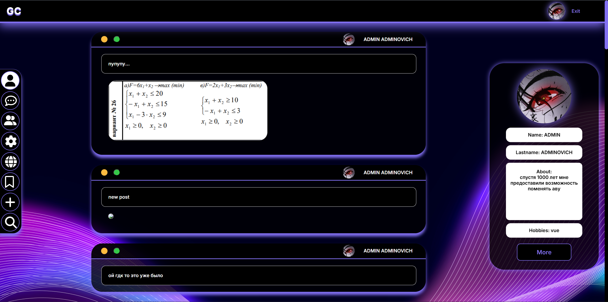
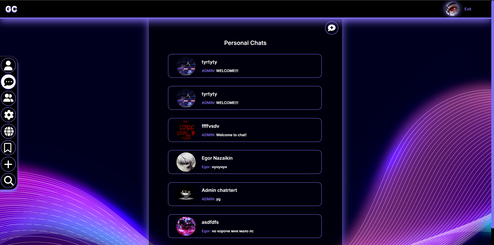
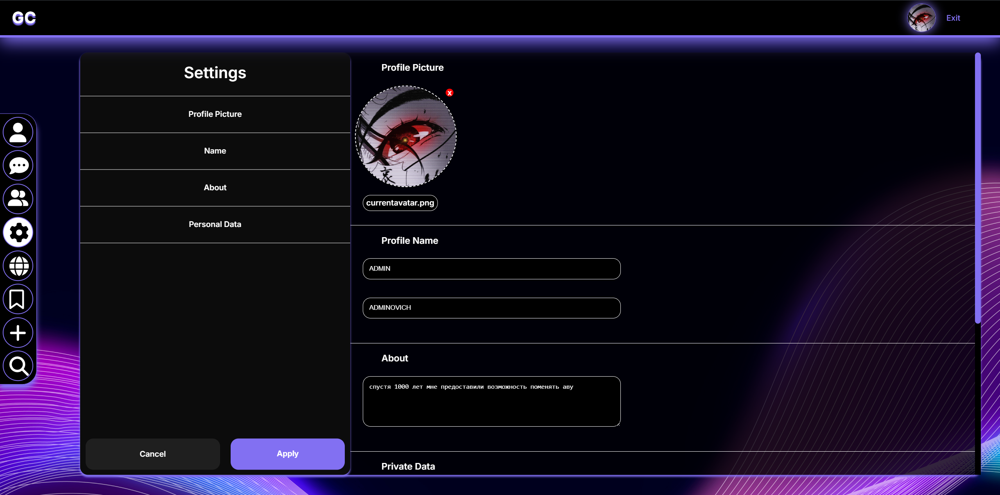
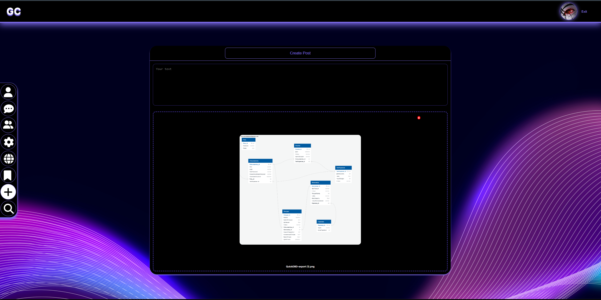
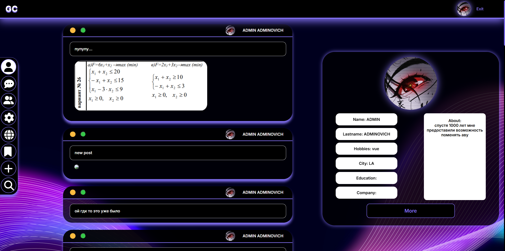

# GoodChat — социальная платформа с мессенджером и лентой постов

### GoodChat — это fullstack-приложение для общения, публикации постов и управления социальными связями. Пользователь работает через веб-интерфейс, а данные обрабатываются Django API и хранятся в локальной базе.

---

## Основные возможности

### Для пользователей:

* Регистрация и авторизация через JWT
* Личный профиль с аватаром, описанием и дополнительной информацией
* Лента постов с комментариями
* Закладки на посты
* Поиск пользователей
* Система друзей и заявок в друзья
* Личные диалоги
* Групповые чаты с настройками участников

### Для интерфейса общения:

* Список чатов и быстрый переход в диалоги
* Отправка сообщений в реальном времени через API polling-подход
* Отображение аватаров, участников и последнего сообщения
* Управление мультичатами и ролями доступа

---

## Архитектура и стек

Проект состоит из двух основных частей: frontend-клиента и backend API. Для локального запуска используется `docker compose`.

### Backend:

* **Python 3.11 + Django 5**
* **Django REST Framework**
* **JWT Authentication** через `djangorestframework-simplejwt`
* **SQLite** как текущая база данных
* **Pillow** для работы с изображениями и аватарами

### Frontend:

* **Vue 3**
* **Vue Router**
* **Vuex**
* **Axios**
* **Vue CLI**

### Infrastructure:

* **Docker**
* **Docker Compose**
* **Nginx** для production-развертывания на VPS

---

## Структура проекта

```text
Goodchat/
├── backend/      # Django backend, API, models, media, SQLite
├── frontend/     # Vue frontend
├── deploy/       # Шаблоны и конфиги для VPS/Nginx
├── docker-compose.yml
└── .env.example
```

---

## Локальный запуск

### Требования:

* Docker
* Docker Compose

### Шаги запуска:

1. Подготовить переменные окружения:

```bash
cp .env.example .env
```

2. Собрать контейнеры:

```bash
docker compose build
```

3. Запустить проект:

```bash
docker compose up
```

После запуска сервисы будут доступны по адресам:

* Frontend: `http://localhost:3000`
* Backend: `http://localhost:8000`

---

## Развертывание на VPS

Для production-сценария в проекте подготовлены:

* `.env` с доменами, IP и публичными URL
* шаблон `nginx` для reverse proxy
* Docker-сборка frontend и backend

Базовая схема:

* `https://your-domain.com` -> frontend
* `https://api.your-domain.com` -> backend

Для Nginx используется шаблон:

* [deploy/nginx/vps.conf.template](C:/Users/Leo/Goodchat/deploy/nginx/vps.conf.template)

Пример переменных:

```env
BACKEND_PUBLIC_URL=https://api.example.com
FRONTEND_PUBLIC_URL=https://example.com
DJANGO_ALLOWED_HOSTS=example.com,api.example.com
VUE_APP_API_BASE_URL=https://api.example.com/api
```

---

## Демонстрация

Ниже несколько экранов интерфейса:






